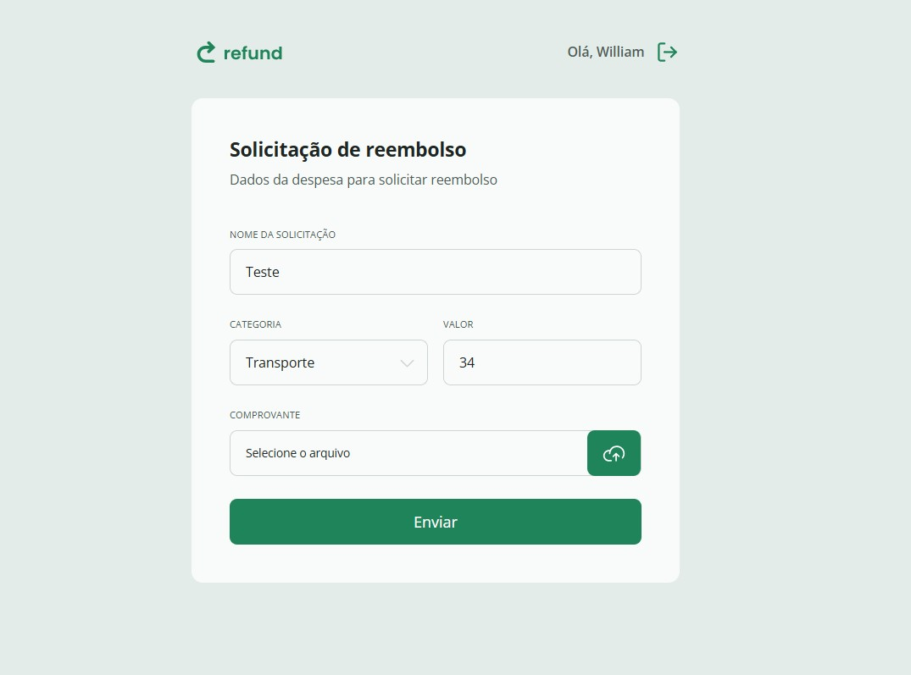

# 💸 Refund

Aplicação **front-end** desenvolvida em **React + TypeScript** para uma **Solicitação de Reembolso**.  
O projeto simula um cenário real de negócio, permitindo que usuários registrem, visualizem e gerenciem solicitações de reembolso de forma simples e organizada.

---

## 📸 Preview



---

## 🚀 Funcionalidades

- 🧾 Criação de solicitações de reembolso
- ✏️ Edição de solicitações
- 🗑️ Remoção de solicitações
- 📋 Listagem de reembolsos cadastrados
- 📊 Visualização de valores solicitados
- 🧑 Organização por usuário/colaborador
- 🕒 Controle de status da solicitação (pendente, aprovado, recusado)

---

## 🧠 Conceitos aplicados

- Componentização com React
- Gerenciamento de estado
- Tipagem forte com TypeScript
- Manipulação de formulários
- Renderização condicional
- Reutilização de componentes
- Boas práticas de UI/UX
- Organização de projeto front-end

---

## 🛠️ Tecnologias utilizadas

- React
- TypeScript
- Tailwind CSS
- Vite
- ESLint
- Git & GitHub

---

## 📂 Estrutura do projeto

```bash
src/
 ├─ components/
 ├─ pages/
 ├─ styles/
 ├─ types/
 ├─ services/
 ├─ App.tsx
 └─ main.tsx
```

---

## ⚙️ Como executar o projeto

### Pré-requisitos

- Node.js (LTS)
- npm ou yarn

### Passo a passo

```bash
git clone https://github.com/williamdelimacx/refund.git
cd refund
npm install
npm run dev
```

A aplicação estará disponível em:  
👉 http://localhost:5173

---

## 🎯 Objetivo do projeto

Projeto desenvolvido para **praticar React com TypeScript**, simulando o **front-end de um sistema de solicitação de reembolso**, além de servir como **projeto de portfólio**.

---

## 📄 Licença

Este projeto está sob a licença MIT.
